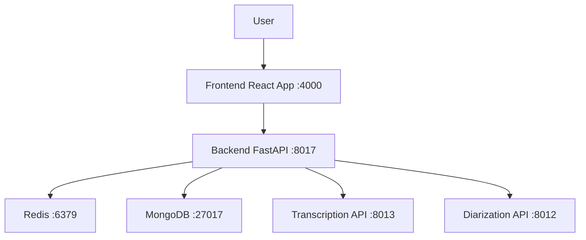

# Audio Transcription & Diarization Web UI

## Overview

This project implements an AI-powered web application for audio transcription and diarization services. It provides a secure, user-friendly interface for uploading audio files and processing them through advanced AI models, with robust authentication, authorization, and audit logging.

## Features

- **User Authentication & Authorization**: Secure login with username/email and password, HTTP-only session cookies, Redis-based session management with automatic expiry and duration tracking.
- **API Key Security**: Secure interactions with internal transcription and diarization services using API keys.
- **Upload Quotas**: User-specific upload limits (e.g., User A: 20 uploads, User B: 4 uploads) enforced via Redis counters, supporting concurrent multi-user operations.
- **Profile Management**: User-friendly profile UI displaying username, email, generated API key, and logout functionality.
- **Audit Trail**: Comprehensive logging in structured JSON format persisted in MongoDB, capturing authentication events, API access, usage logs, file uploads, and session details.
- **History Tracking**: Persistent storage of all transcription/diarization results in MongoDB for later retrieval.
- **Download Functionality**: Ability to download processed results in JSON and Markdown formats from the history page.
- **Scalable Architecture**: Built with FastAPI (backend), React (frontend), Redis (session/counter management), and MongoDB (logging).
- **Cross-Origin Support**: Proper CORS configuration for secure cross-origin communication.

## Architecture

The application consists of four main services:

- **Backend (FastAPI)**: Handles authentication, file uploads, API routing, and integration with transcription/diarization services. Runs on port 8017.
- **Frontend (React)**: Provides the user interface for login, registration, file upload, and results display. Runs on port 4000.
- **Redis**: Manages user sessions and upload counters.
- **MongoDB**: Stores audit logs and usage data.

### High-Level Diagram



## Tech Stack

- **Backend**: FastAPI, SQLAlchemy, Redis, PyMongo, uvicorn, httpx, websockets
- **Frontend**: React, React Router, Vite
- **Database**: SQLite (users), Redis (sessions/counters), MongoDB (logs)
- **Deployment**: Docker, Docker Compose
- **Security**: bcrypt, python-jose, CORS

## Setup Instructions

### Prerequisites

- Docker and Docker Compose
- Node.js (for frontend development)
- Python 3.8+ (for backend development)

### Environment Variables

Create a `.env` file in the root directory with the following variables:

```
API_KEY=your_api_key_here
# Add other necessary env vars like database URLs if needed
```

### Running with Docker Compose

1. Clone the repository
2. Navigate to the project root
3. Run `docker-compose up --build`

This will start all services:
- Backend: http://localhost:8017
- Frontend: http://localhost:4000
- Redis: localhost:6379
- MongoDB: localhost:27017

### Development Setup

#### Backend

1. Navigate to `backend/`
2. Install dependencies: `pip install -r requirements.txt`
3. Run the server: `uvicorn main:app --reload --port 8017`

#### Frontend

1. Navigate to `frontend/`
2. Install dependencies: `npm install`
3. Run the development server: `npm run dev`

## Usage

1. Access the frontend at http://localhost:4000
2. Register a new account or login
3. Upload an audio file and select transcription or diarization mode
4. View results in the UI
5. Check your profile for API key and usage stats
6. Access your history to view past transcriptions and download results

## API Documentation

### Authentication Endpoints

- `POST /auth/login` - User login
- `POST /auth/register` - User registration
- `POST /auth/logout` - User logout
- `GET /auth/me` - Get current user info

### Upload Endpoints

- `POST /upload` - Upload audio file for processing
  - Parameters: `file` (UploadFile), `mode` (transcribe|diarize)
  - Requires authentication

### History Endpoints

- `GET /history` - Get user's transcription/diarization history
  - Returns list of processed files with metadata
  - Requires authentication
- `GET /transcription/{transcription_id}` - Get specific transcription result
  - Returns the full transcription/diarization result for the given ID
  - Requires authentication

### WebSocket

- `WS /ws/diarize` - Real-time diarization with audio streaming

## Security Features

- HTTP-only session cookies
- API key authentication for internal services
- User-specific upload quotas
- Comprehensive audit logging
- CORS configuration for secure cross-origin requests

## Contributing

1. Fork the repository
2. Create a feature branch
3. Make your changes
4. Submit a pull request

## License

[Add license information if applicable]


# Audio Gateway Application

A comprehensive audio processing application that provides transcription and diarization services with user authentication, admin management, and usage tracking.

## Overview

The Audio Gateway is a full-stack application that allows users to upload audio files and process them using either transcription or diarization services. The application features user authentication, admin management, usage limits, and API key management.

## Architecture

The application follows a microservices architecture with the following components:

- **Frontend**: React-based user interface
- **Backend**: FastAPI-based gateway service
- **Database**: MongoDB for user data and API keys
- **Cache**: Redis for session management and rate limiting
- **External Services**: Transcription and diarization APIs

## Features

### User Authentication
- User registration with username, email, and password
- Secure login/logout functionality
- Session management using Redis
- Password hashing with bcrypt
- HTTP-only cookies for session security

### Audio Processing
- **Transcription**: Convert audio to text
- **Diarization**: Identify and separate speakers in audio
- File upload with progress tracking
- Support for various audio formats
- Real-time WebSocket processing for live audio

### User Management
- User profiles with upload limits
- API key generation and management
- Upload quota tracking
- Session duration monitoring

### Admin Features
- User management dashboard
- Upload limit adjustment
- API key activation/deactivation
- Usage analytics
- Rate limit monitoring

### Security Features
- Two-factor authentication (session + API key)
- Rate limiting per user
- Secure password storage
- Session expiration and sliding sessions
- Admin access control

### API Endpoints

#### Authentication Endpoints
- `POST /register` - User registration
- `POST /login` - User login
- `POST /logout` - User logout
- `GET /me` - Get user profile
- `GET /protected` - Verify authentication

#### Audio Processing Endpoints
- `POST /upload` - Upload and process audio files
- `GET /ws/diarize` - WebSocket endpoint for live diarization

#### Admin Endpoints
- `GET /admin/users` - List all users
- `PUT /admin/users/{user_id}/upload-limit` - Update user upload limit
- `PUT /admin/api-keys/{user_id}/activate` - Activate API key
- `PUT /admin/api-keys/{user_id}/deactivate` - Deactivate API key
- `GET /admin/usage` - Get usage analytics
- `GET /admin/rate-limits` - Get rate limit stats

## Technology Stack

### Backend
- **Framework**: FastAPI
- **Database**: MongoDB
- **Cache**: Redis
- **Authentication**: JWT, bcrypt, sessions
- **HTTP Client**: httpx
- **WebSockets**: websockets library

### Frontend
- **Framework**: React
- **Router**: React Router DOM
- **Build Tool**: Vite
- **Styling**: CSS

### Infrastructure
- **Containerization**: Docker & Docker Compose
- **Reverse Proxy**: Nginx (frontend)
- **Deployment**: Multi-container setup

## Installation and Setup

### Prerequisites
- Docker and Docker Compose
- Node.js (for local development)
- Python 3.10+

### Environment Variables
Create a `.env` file in the root directory:
```env
API_KEY=your_api_key_here
```

### Running the Application
1. Clone the repository
2. Create the `.env` file with required variables
3. Run the application using Docker Compose:
```bash
docker-compose up --build
```

The application will be available at:
- Frontend: http://localhost:4000
- Backend API: http://localhost:8017

### Development Setup
For frontend development:
```bash
cd frontend
npm install
npm run dev
```

For backend development:
```bash
cd backend
pip install -r requirements.txt
uvicorn main:app --reload
```

## Usage

### User Registration
1. Navigate to the registration page
2. Enter username, email, and password
3. Account is created with an inactive API key
4. Contact admin to activate the API key

### Audio Processing
1. Log in to the application
2. Select an audio file to upload
3. Choose processing mode (transcription or diarization)
4. Wait for processing to complete
5. View and download results in JSON or Markdown format

### Admin Management
1. Log in as an admin user
2. Navigate to the admin dashboard
3. Manage users, upload limits, and API keys
4. Monitor usage and rate limits

## Database Schema

### Users Collection
- `_id`: ObjectId
- `username`: string
- `email`: string
- `password`: string (hashed)
- `upload_limit`: number
- `created_at`: timestamp
- `is_admin`: boolean (optional)

### API Keys Collection
- `_id`: ObjectId
- `user_id`: string
- `key_hash`: string (hashed)
- `key_enc`: string (encrypted)
- `active`: boolean
- `created_at`: timestamp
- `activated_at`: timestamp (optional)
- `last_used_at`: timestamp (optional)

### Usage Collection
- `user_id`: string
- `files_uploaded`: number
- `seconds_processed`: number

### Transcriptions Collection
- `_id`: ObjectId
- `user_id`: string
- `username`: string
- `filename`: string
- `mode`: string (transcribe|diarize)
- `result`: object (the transcription/diarization result)
- `created_at`: timestamp
- `duration_sec`: number
- `file_size`: number

## Security Considerations

1. **Password Security**: Passwords are hashed using bcrypt with SHA-256 preprocessing
2. **Session Security**: HTTP-only cookies with secure flags
3. **API Key Security**: Encrypted storage and hash-based verification
4. **Rate Limiting**: Per-user upload limits stored in Redis
5. **Input Validation**: FastAPI request validation
6. **CORS**: Restricted to localhost:4000

## Logging

The application implements comprehensive logging for:
- Authentication events
- API requests and responses
- Upload processing
- Admin actions
- WebSocket connections
- Error tracking

## Deployment

The application is designed for containerized deployment using Docker Compose. The setup includes:
- Backend service with FastAPI
- Frontend service with Nginx
- Redis for session management
- MongoDB for data persistence

## API Key Management

Users receive an API key upon registration, but it's inactive by default. Admins can:
- Activate/deactivate API keys
- Monitor API key usage
- Generate new API keys for users

## WebSocket Support

The application includes WebSocket support for real-time audio diarization, allowing live processing of audio streams.

## Error Handling

The application implements comprehensive error handling with:
- Proper HTTP status codes
- Detailed error messages
- Logging of all errors
- User-friendly error messages in the UI

## Testing

While not explicitly shown in the codebase, the application structure supports:
- Unit testing for API endpoints
- Integration testing for authentication flows
- End-to-end testing for user workflows

## Contributing

1. Fork the repository
2. Create a feature branch
3. Make changes
4. Submit a pull request

## License

This project is licensed under the MIT License - see the LICENSE file for details.