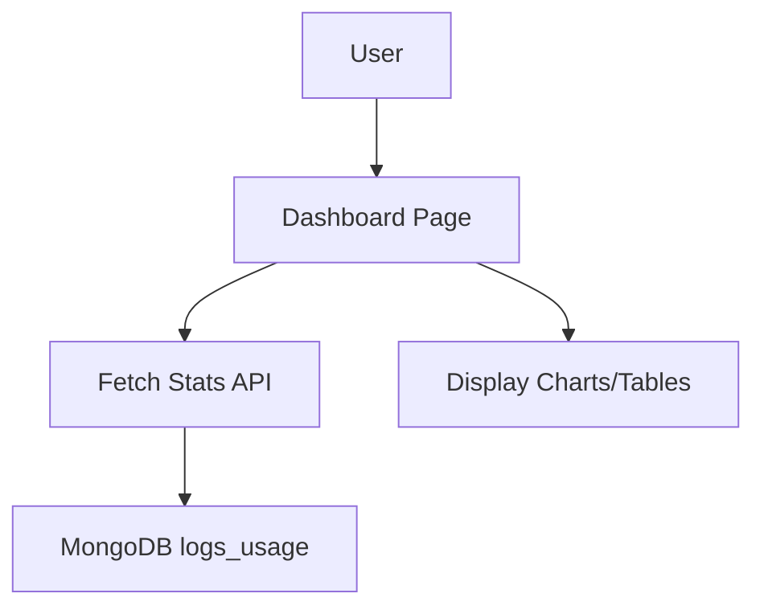
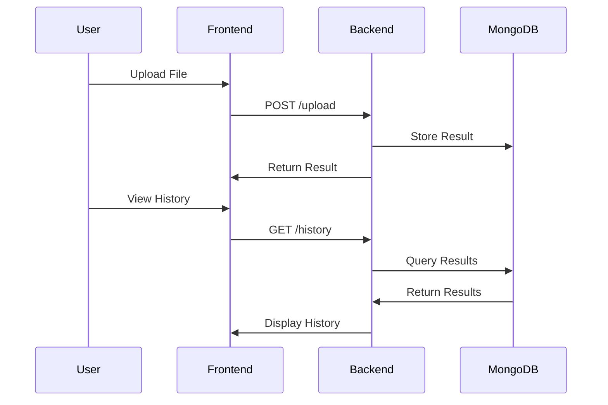
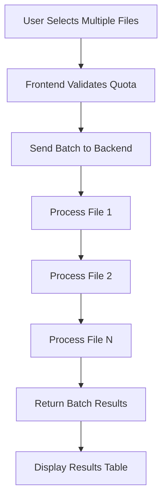
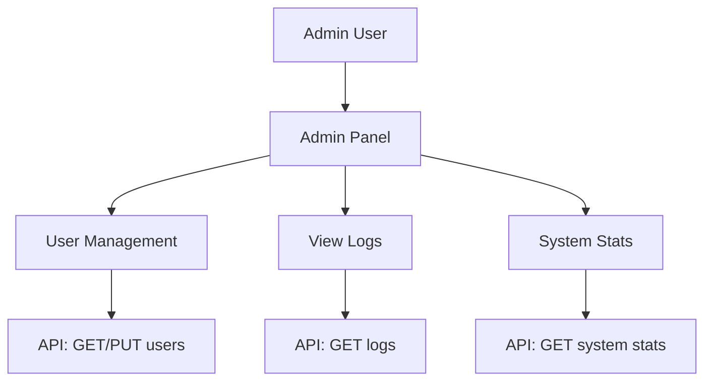

# Additional Features and Improvements Design

## Overview
This document outlines proposed enhancements to the Audio Transcription & Diarization Web UI, focusing on user experience, functionality, and administrative capabilities.

## 1. User Dashboard with Analytics

### Description
A comprehensive dashboard displaying user-specific statistics, usage metrics, and recent activity.

### Features
- **Quota Usage Widget**: Visual representation of current upload limit vs. used uploads
- **Recent Uploads Table**: List of last 10 uploads with status, timestamp, and processing time
- **Usage Charts**: 
  - Bar chart of uploads per day/week
  - Line chart of average processing times
- **Summary Stats**: Total uploads, total processing time, success rate

### Backend Changes
- New endpoint: `GET /dashboard/stats` - aggregates data from MongoDB logs_usage collection
- Query logs for user_id, group by date, calculate metrics
- Return JSON with stats and recent uploads

### Frontend Changes
- New `Dashboard.jsx` page
- Integrate chart library (e.g., Chart.js or Recharts)
- Add navigation to dashboard from profile or main menu

### Database
- Utilize existing logs_usage collection
- Consider adding results collection for better performance

## 2. File History and Results Storage

### Description
Persistent storage of processed results for later retrieval and analysis.

### Features
- Store results in MongoDB upon successful processing
- Retrieve past results with pagination
- Download/view previous transcriptions/diarizations
- Search by filename, date, mode

### Backend Changes
- Modify `/upload` endpoint to store results in `results` collection
- New endpoint: `GET /history` - paginated results for user
- Result document: {user_id, filename, mode, result, timestamp, status}

### Frontend Changes
- Add "History" tab to dashboard
- Results viewer component for displaying stored data
- Download buttons for JSON/text formats

### Security
- Ensure results are user-isolated
- Consider encryption for sensitive audio data if stored

## 3. Batch Processing

### Description
Allow users to upload and process multiple audio files simultaneously.

### Features
- Multi-file upload interface
- Sequential processing of files
- Progress indicators for each file
- Combined results download
- Quota check across all files

### Backend Changes
- Modify `/upload` to accept `files: List[UploadFile]`
- Loop through files, process each, collect results
- Return array of results with individual statuses

### Frontend Changes
- Update UploadForm to support multiple file selection
- Add progress bars for batch processing
- Display results table with individual file statuses

### Limitations
- Processing time may be longer for large batches
- Consider implementing job queuing for very large batches

## 4. Admin Panel

### Description
Administrative interface for managing users, monitoring system usage, and viewing logs.

### Features
- **User Management**: List all users, edit quotas, deactivate accounts
- **System Logs**: View API access logs with filtering and search
- **Usage Analytics**: System-wide statistics and charts
- **Settings**: Configure default quotas, enable/disable features

### Backend Changes
- Add `role` field to User model (default: "user")
- New router: `admin.py` with endpoints:
  - `GET /admin/users` - list users (admin only)
  - `PUT /admin/users/{id}` - update user (admin only)
  - `GET /admin/logs` - paginated logs (admin only)
- Dependency: `get_admin_user` to check role

### Frontend Changes
- New `Admin.jsx` page (conditional rendering)
- User management table with edit forms
- Logs viewer with filters (date, user, endpoint)
- Charts for system usage

### Security
- Restrict admin endpoints to role-based access
- Log admin actions for audit

## Implementation Priority

1. **High Priority**: User Dashboard, File History - Immediate user value
2. **Medium Priority**: Batch Processing - Productivity enhancement
3. **Low Priority**: Admin Panel - Operational management

## Technical Considerations

- **Scalability**: Ensure MongoDB queries are optimized with indexes
- **Performance**: Implement caching for dashboard stats
- **Security**: Add input validation, rate limiting for admin endpoints
- **UI/UX**: Maintain consistent design with existing components
- **Testing**: Add unit tests for new endpoints and components

## Next Steps

1. Implement User Dashboard and File History as core improvements
2. Gather user feedback on dashboard features
3. Proceed with Batch Processing based on usage patterns
4. Develop Admin Panel for production deployment